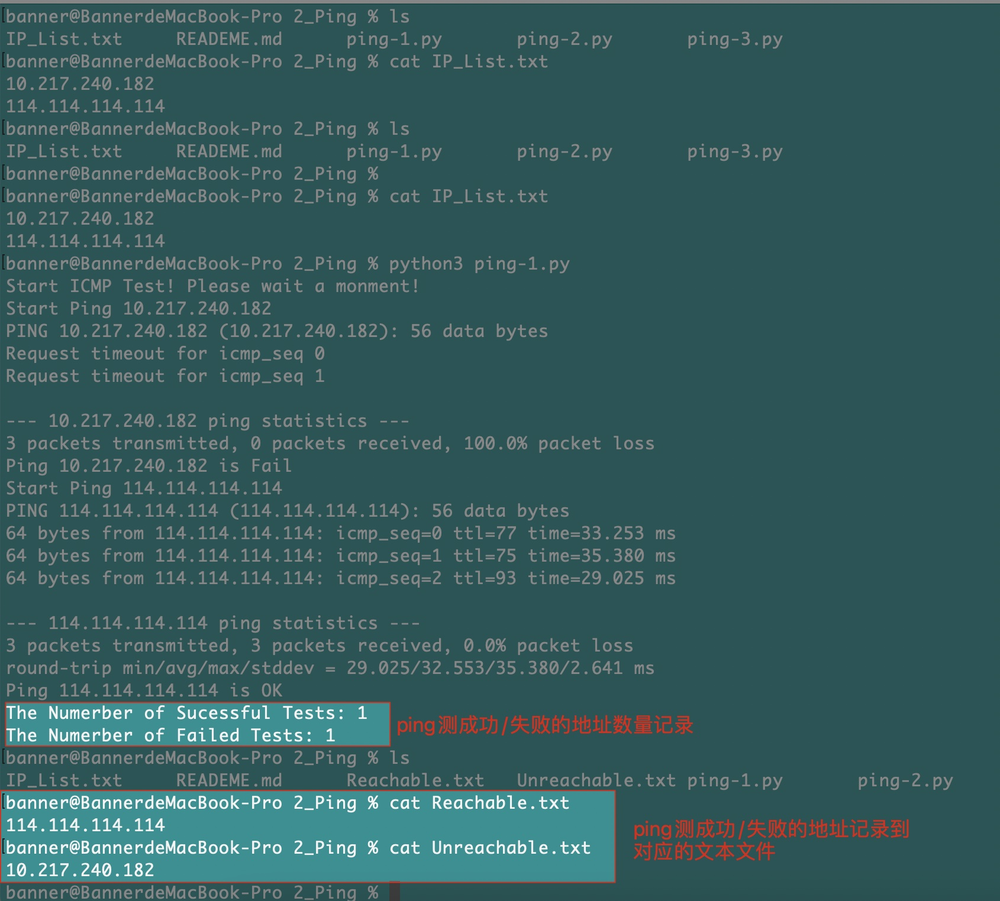
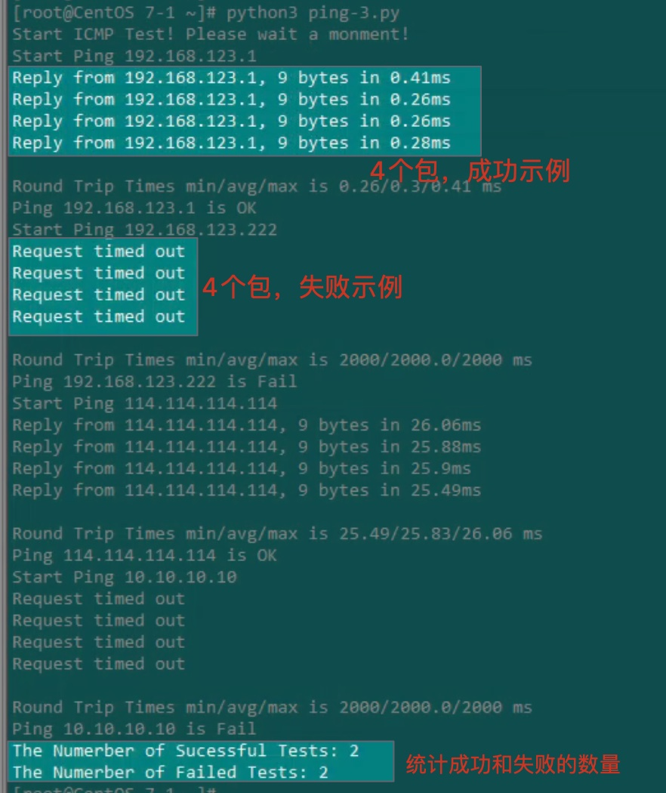

1、脚本说明：

    ping-1.py:使用os方式来实现ping；
    ping-2.py:使用subprocess来实现批量ping；
    ping-3.py:使用pythonping来实现批量ping；
    
    Note: 
        os,subprocess会将回显内容打印出来；
        pythonping需要系统权限；
        
        

2、代码运行测试
        
    ping-1.py
        
    

    ping-2.py
    
        subprocess效果和os.system运行效果其实是一致的，返回值如果是0，表明ping测成功

    

    ping-3.py
    在 pythonping 中，ping()函数默认对目标 IP 地址 ping 4 次，当目标 IP 地址可达时，ping()函数返回的是“Reply from x.x.x.x, x bytes in xx.xx ms”；
    ping()函数返回值的类型是一个叫作 pythonping.executor.ResponseList 的特殊类型，所以为了使用运算符in做判断，必须通过str()函数进行转换；

    
    
