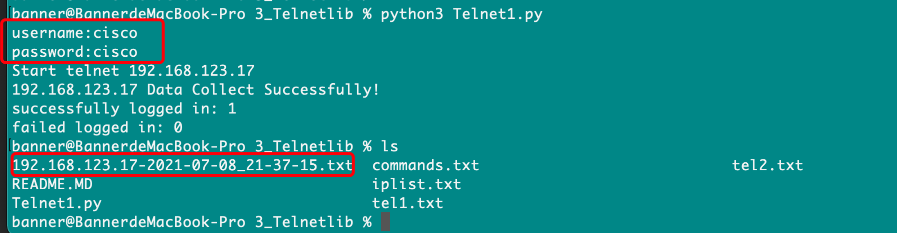

1、Telnetlib模块介绍
        
    1、使用python实现telnet网络设备，需要用到一个telnetlib的内建模块，不需要额外安装。
    2、python2和python3对telnetlib的使用有点差异
        Python2中telnetlib模块下的所有函数返回的是字符串，python3返回的是字节型字符串（Byte String）。使用python3注意以下几点：
            在字符串前需要加一个b。
            在变量和Telnetlib函数后面需要加 .encode('ascii')函数
            在read_all()函数后面需要加航decode('ascii')函数

    3、telnet是个不安全的协议，所以不建议使用，在生产环境中更偏向使用ssh协议

2、效果展示
            
   