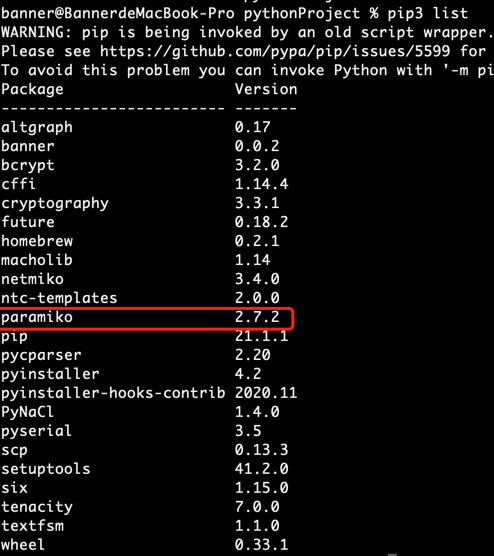
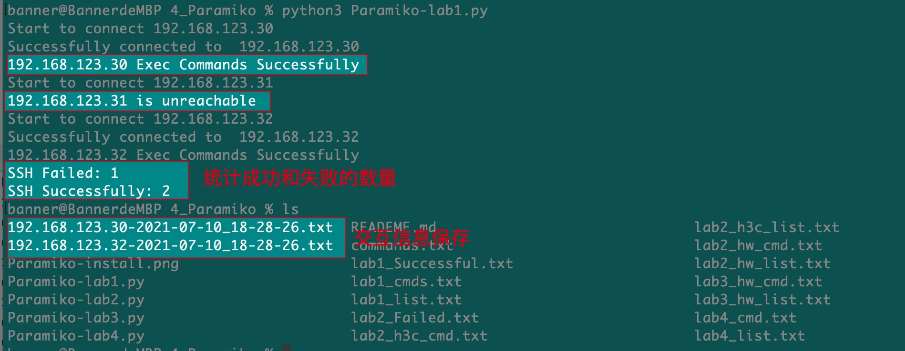

1、脚本说明：

    lab1:paramiko使用示例：
        lab1_cmds.txt需要预先准备，是需要执行的命令
        lab1_list.txt文本是设备ip地址，提前准备好
        其他文件都是在运行中自动生成，不用管，其中tel1和tel2每次会自动覆盖
    lab2:主要介绍sys.argv[]使用方法，参数传递。
    lab3:是一个华为设备ssh登陆，收集信息的示例
    lab4:ssh链接设备，针对异常进行处理，判断是账户问题还是网络问题
2、paramiko注意事项
        
    1、Paramiko 不会在做配置的时候替我们自动加上 config term、end 和 write memory 等命令，也不会在执行各种 show/display命令后自动保存该命令的回显内容。一切都需要我们手动搞定。
    2、Python 是一次性执行所有脚本里的命令，中间没有间隔时间。当你要一次性输入很多条命令时，便经常会发生 SSH 终端跟不上速度，导致某些命令缺失没有被输入的问题。同样，在用 print()函数输入回显内容或者用open.write()将回显内容写入文档中保存时，也会因为缺乏间隔时间而导致 Python“截屏”不完整，从而导致回显内容不完整。 
    Netmiko 自动帮我们解决了这个问题，也就是说，不管 Netmiko config_commands 列表中的元素（命令）有多少个，都不会出现因为间隔时间不足而导致配置命令缺失的问题。而在 Paramiko 中，我们必须导入 time 模块，使用该模块的 sleep()方法来解决这个问题
    3、 paramiko是第三方模块，需要pip安装,安装好以后就可以直接在脚本中import导入使用了

3、准备工作
        
        1、安装paramiko，pip3 install paramiko，验证

4、脚本运行效果

    Paramiko-lab1

